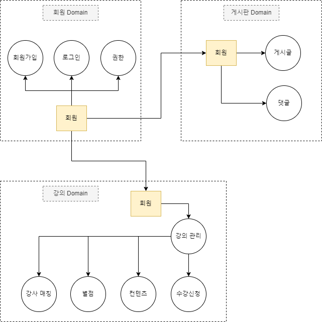
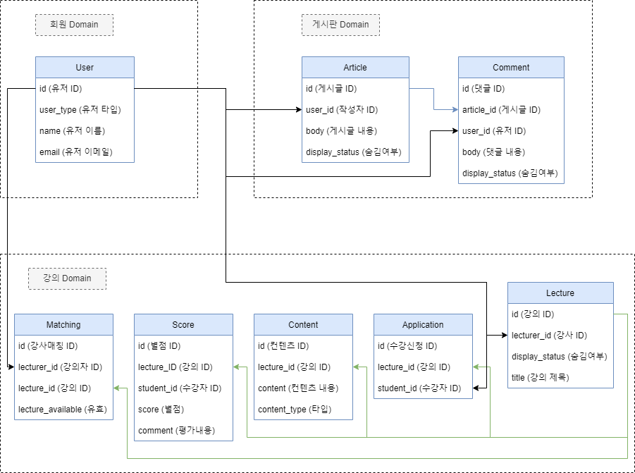

# DDD_onlineLecture

## 도메인 모델 그리기

## 도메인 엔티티

### 보드 도메인
[Board Domain](https://github.com/donchanee/DDD_onlineLecture/tree/main/week2ass3/boardDomain/src/main/java/com/codestates/boarddomain)

### 강의 도메인
[Lecture Domain](https://github.com/donchanee/DDD_onlineLecture/tree/main/week2ass3/lectureDomain/src/main/java/com/codestates/lecturedomain)

### 유저 도메인
[User Domain](https://github.com/donchanee/DDD_onlineLecture/tree/main/week2ass3/userDomain/src/main/java/com/codestates/userdomain)

각 도메인의 services 안에 Service Interface 정의가 있고,

각 도메인의 routers 안에 API endpoint가 존재합니다.
